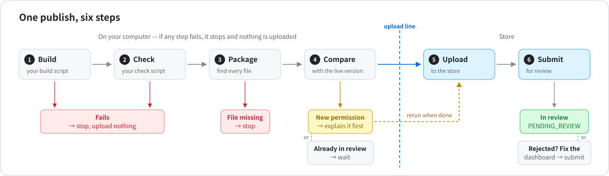
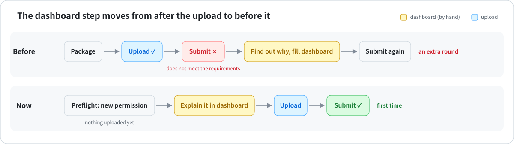
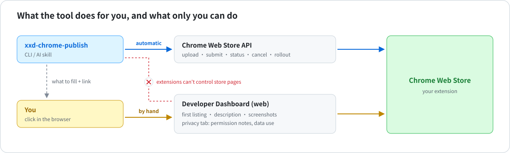

# xxd-chrome-publish

<div dir="rtl">

[简体中文](README.md) · [繁體中文](README.zh-TW.md) · [English](README.en.md) · [日本語](README.ja.md) · [한국어](README.ko.md) · [Español](README.es.md) · [Français](README.fr.md) · [Deutsch](README.de.md) · **العربية**

**انشر تحديثات إضافات Chrome بأمر واحد.**
تبني الإضافة وتضغطها وترفعها وترسلها للمراجعة، وتخبرك *قبل الرفع* إن كان سوق Chrome الإلكتروني سيرفضها.

استخدمها كأمر، أو كمهارة في Claude Code / Codex: قل فقط «انشر إضافتي».

> للإضافات المنشورة مسبقًا فقط. النشر لأول مرة ما زال يتم من لوحة تحكم Chrome.



## ماذا تحل؟



| قبل | مع xxd-chrome-publish |
|---|---|
| ينجح الرفع ثم يفشل الإرسال: *«does not meet the requirements»* | تعرف أولًا أي إذن يحتاج إلى شرح في لوحة التحكم، وأي سطر في الكود يستخدمه |
| ملفات يحمّلها الكود لاحقًا لا تدخل الحزمة، فتتعطل ميزة | تُكتشف وتُضاف تلقائيًا |
| رفع نسخة بناء قديمة بالخطأ | تعمل سكربتات البناء والاختبار أولًا، وإن فشلت لا يُرفع شيء |
| رقم الإصدار يتعارض مع المتجر | يُحسب الإصدار التالي من الكود والمتجر معًا |
| تنسى أي الإضافات فيها تغييرات لم تُنشر | جدول واحد يعرضها كلها |

## البدء السريع

**1. التثبيت**

</div>

```bash
git clone https://github.com/nevertoday/xxd-chrome-publish ~/code/xxd-chrome-publish
ln -s ~/code/xxd-chrome-publish ~/.claude/skills/xxd-chrome-publish   # as a Claude skill (Codex: ~/.codex/skills)
sh ~/code/xxd-chrome-publish/scripts/install.sh                       # as a command
```

<div dir="rtl">

**2. اربط حساب المتجر** (مرة واحدة · [الخطوات بالتفصيل](references/setup.md))

</div>

```bash
xxd-chrome-publish setup --publisher-id <ID from the dashboard URL> --service-account <email>
```

<div dir="rtl">

**3. اربط كل مجلد إضافة بمعرّفها** (مرة واحدة)

</div>

```bash
cd my-extension
xxd-chrome-publish bind --extension-id <extension ID or store link>
```

<div dir="rtl">

**4. انشر**

</div>

```bash
xxd-chrome-publish
```

<div dir="rtl">

## أوامر يومية

| تريد أن | نفّذ |
|---|---|
| ترى ما سيحدث دون تغيير أي شيء | `xxd-chrome-publish preflight` |
| تنشر تحديثًا | `xxd-chrome-publish` |
| تعيد الإرسال بعد إصلاح لوحة التحكم | `xxd-chrome-publish submit` |
| تتابع حالة المراجعة | `xxd-chrome-publish status` |
| تعرف أي الإضافات فيها تغييرات لم تُنشر | `xxd-chrome-publish scan ~/code` |
| تتأكد أن الإعداد يعمل | `xxd-chrome-publish doctor` |

في Claude Code / Codex اطلب فقط: *«انشر إضافة flomo»*، *«أي إضافاتي جاهزة للنشر؟»*

## كيف يبدو الفحص

</div>

```
$ xxd-chrome-publish preflight
Image Crop Tool · ~/code/crop · phdjhhjbapkmagifbejfabimojmjngbe
  store     PUBLISHED 1.0.26
  version   1.0.26 → 1.0.27
  package   27 files · 249 KB
  manifest  vs store: +hosts https://api.example.com/*
  dashboard 1 to-do:
    [required] Justify the new host permissions
    open https://chrome.google.com/webstore/devconsole/…/edit/privacy
  => NEEDS DASHBOARD
```

<div dir="rtl">

وجد هذا الفحص إذنًا جديدًا للوصول إلى موقع. افتح الرابط، واكتب جملة واحدة عن سبب حاجة الإضافة إليه، واحفظ، ثم انشر.

## ما لا تستطيع فعله



لا توفّر Google واجهة برمجية لهذه الأمور، فتبقى في لوحة تحكم Chrome:

- النشر لأول مرة
- وصف المتجر ولقطات الشاشة
- تبويب الخصوصية: شرح الأذونات، واستخدام البيانات، ورابط سياسة الخصوصية

تخبرك الأداة بالضبط بما تكتبه وأين. ولا يستطيع وكيل المتصفح فعل ذلك نيابة عنك أيضًا، لأن Chrome يمنع الإضافات من التحكم في صفحات المتجر.

## التفاصيل

</div>

<details>
<summary><b>تسجيل الدخول: طريقتان</b></summary>

<div dir="rtl">

| الطريقة | مناسبة لـ | ماذا تحتاج |
|---|---|---|
| gcloud + حساب خدمة | جهازك الشخصي، دون ملفات سرية | Google Cloud SDK وحساب خدمة |
| رمز تحديث OAuth | التكامل المستمر (مثل GitHub Actions) | `CWS_CLIENT_ID` و`CWS_CLIENT_SECRET` و`CWS_REFRESH_TOKEN` |

⚠️ ضع حساب الخدمة في حقل **service account** في صفحة Account بلوحة التحكم، **وليس** في «Trusted tester accounts». ذلك الحقل لا يمنح صلاحية الواجهة البرمجية، وستظهر أخطاء 403.

الخطوات كاملة: [references/setup.md](references/setup.md)

</div>
</details>

<details>
<summary><b>كل الخيارات</b></summary>

<div dir="rtl">

| الخيار | ماذا يفعل |
|---|---|
| `--minor` / `--major` | 1.2.3 ← 1.3.0 / 2.0.0 (الافتراضي 1.2.4) |
| `--set-version 1.5.0` | يستخدم هذا الإصدار بالضبط |
| `--no-bump` | يُبقي الإصدار الموجود في manifest.json |
| `--skip-build` / `--skip-checks` | لا يشغّل البناء / الاختبارات |
| `--dashboard-ready` | لوحة التحكم جاهزة، تابِع |
| `--cancel-pending` | يسحب الإصدار قيد المراجعة ويرسل هذا بدلًا منه |
| `--upload-only` | يرفع دون إرسال للمراجعة |
| `--staged` | بعد الموافقة ينتظر حتى تنشره بنفسك |
| `--zip file.zip` | يرفع هذا الملف بدل إنشاء حزمة جديدة |
| `--commit` | يحفظ رقم الإصدار الجديد في git بعد الانتهاء |
| `--json` | مخرجات تقرؤها البرامج |

رموز الخروج: `0` تم · `1` خطأ · `2` إصدار آخر قيد المراجعة · `3` أكمل لوحة التحكم أولًا

</div>
</details>

<details>
<summary><b>إعدادات كل إضافة</b> (<code>.chrome-publish.json</code>)</summary>

```json
{
  "extensionId": "abcdefghijklmnopabcdefghijklmnop",
  "build": "npm run build",
  "check": false,
  "packageDir": "dist",
  "include": ["assets/models/**"],
  "exclude": ["fixtures/**"]
}
```

<div dir="rtl">

| الحقل | المعنى |
|---|---|
| `extensionId` | المعرّف المكوّن من 32 حرفًا في رابط المتجر |
| `build` | أمر البناء أو `false`. الافتراضي: سكربت `build` في package.json |
| `check` | أمر الاختبار أو `false`. الافتراضي: سكربت `check` في package.json |
| `packageDir` | المجلد الذي يُضغط، إن كان البناء يكتب في `dist` مثلًا |
| `include` / `exclude` | ملفات تُضاف دائمًا / لا تُضاف أبدًا |

</div>
</details>

<details>
<summary><b>التحديث والتطوير</b></summary>

```bash
git -C ~/code/xxd-chrome-publish pull   # update (the skill link and the command both point here)
npm test                                 # run the tests (uses a fake local store)
npm run diagrams                         # regenerate the diagrams (after editing build.mjs)
```

<div dir="rtl">

كيف تكتب شرح أذونات يقبله المراجعون: [references/dashboard.md](references/dashboard.md) ·
رسائل الأخطاء وحلولها: [references/troubleshooting.md](references/troubleshooting.md)

</div>
</details>

<div dir="rtl">

مرخّصة بموجب MIT

</div>
