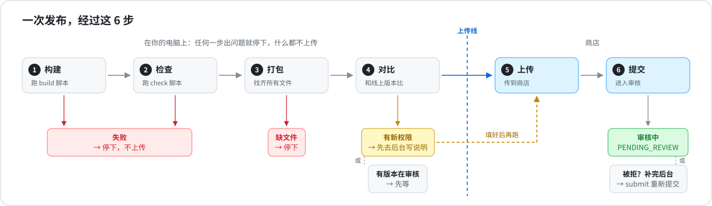
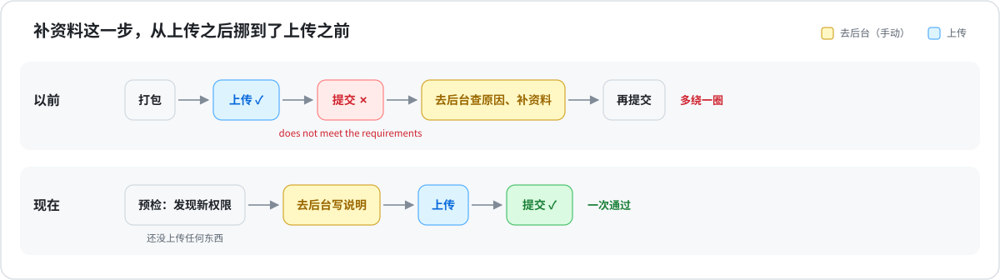
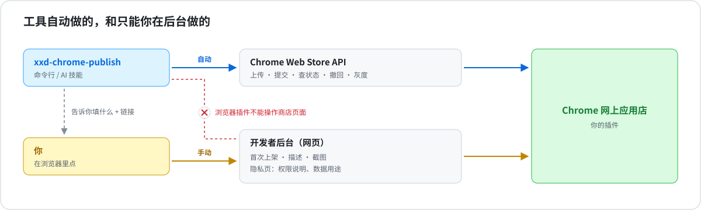

# xxd-chrome-publish

**简体中文** · [繁體中文](README.zh-TW.md) · [English](README.en.md) · [日本語](README.ja.md) · [한국어](README.ko.md) · [Español](README.es.md) · [Français](README.fr.md) · [Deutsch](README.de.md) · [العربية](README.ar.md)

**一条命令，发布 Chrome 插件的更新。**
自动构建、打包、上传、提交审核。上传之前就告诉你，商店会不会拒。

可以当命令用，也可以装进 Claude Code / Codex，直接说“把这个插件发了”。

> 只适用于已经上架的插件。第一次上架还是要去 Chrome 后台。



## 它帮你解决什么



| 以前 | 现在 |
|---|---|
| 上传成功了，提交却被拒：*“does not meet the requirements”* | 提前告诉你哪个权限要去后台写说明，还指出代码里哪一行用到了它 |
| 代码后来才加载的文件没打进包，发出去功能坏了 | 自动找出来，一起打包 |
| 不小心传了旧的构建 | 先跑你的构建和测试脚本，失败就不传 |
| 版本号和商店撞了被拒 | 同时参考代码和商店，算出下一个版本号 |
| 记不清哪些插件有改动还没发 | 一张表全部列出来 |

## 快速开始

**1. 安装**

```bash
git clone https://github.com/nevertoday/xxd-chrome-publish ~/code/xxd-chrome-publish
ln -s ~/code/xxd-chrome-publish ~/.claude/skills/xxd-chrome-publish   # 当 Claude 技能用（Codex 是 ~/.codex/skills）
sh ~/code/xxd-chrome-publish/scripts/install.sh                       # 当命令用
```

**2. 连上你的商店账号**（只需一次，[详细步骤](references/setup.md)）

```bash
xxd-chrome-publish setup --publisher-id <后台网址里的 ID> --service-account <服务账号邮箱>
```

**3. 给每个插件目录绑定 ID**（只需一次）

```bash
cd 插件目录
xxd-chrome-publish bind --extension-id <扩展 ID 或商店链接>
```

**4. 发布**

```bash
xxd-chrome-publish
```

## 常用命令

| 你想 | 敲 |
|---|---|
| 先看看会发生什么，什么都不改 | `xxd-chrome-publish preflight` |
| 发布更新 | `xxd-chrome-publish` |
| 后台补完资料，重新提交 | `xxd-chrome-publish submit` |
| 查审核进度 | `xxd-chrome-publish status` |
| 看哪些插件有改动还没发 | `xxd-chrome-publish scan ~/code` |
| 检查配置对不对 | `xxd-chrome-publish doctor` |

在 Claude Code / Codex 里直接说就行：*“把 flomo 那个插件发了”*、*“看看哪些插件可以发”*。

## 检查结果长这样

```
$ xxd-chrome-publish preflight
Image Crop Tool · ~/code/crop · phdjhhjbapkmagifbejfabimojmjngbe
  store     PUBLISHED 1.0.26
  version   1.0.26 → 1.0.27
  package   27 files · 249 KB
  manifest  vs store: +hosts https://api.example.com/*
  dashboard 1 to-do:
    [required] Justify the new host permissions
    open https://chrome.google.com/webstore/devconsole/…/edit/privacy
  => NEEDS DASHBOARD
```

这次检查发现新加了一个网站权限。打开链接，写一句插件为什么需要它，保存，再发布就行。

## 它做不到的



下面这些 Google 没有开放接口，只能在 Chrome 后台操作：

- 第一次上架
- 商店描述和截图
- 隐私页：权限说明、数据用途、隐私政策链接

工具会告诉你具体要填什么、去哪里填。浏览器 AI 助手也替你填不了，因为 Chrome 不允许任何插件操作商店页面。

## 细节（点开看）

<details>
<summary><b>登录方式：两种选一种</b></summary>

| 方式 | 适合 | 需要什么 |
|---|---|---|
| gcloud + 服务账号 | 自己电脑上用，不存密钥文件 | 装 Google Cloud SDK，建一个服务账号 |
| OAuth refresh token | CI（比如 GitHub Actions） | `CWS_CLIENT_ID`、`CWS_CLIENT_SECRET`、`CWS_REFRESH_TOKEN` 三个环境变量 |

⚠️ 服务账号要填在后台 Account 页的 **service account** 那一栏，**不是**旁边的 “Trusted tester accounts”。那一栏没有接口权限，填错了会一直报 403。

完整步骤：[references/setup.md](references/setup.md)

</details>

<details>
<summary><b>全部参数</b></summary>

| 参数 | 作用 |
|---|---|
| `--minor` / `--major` | 1.2.3 → 1.3.0 / 2.0.0（默认是 1.2.4） |
| `--set-version 1.5.0` | 就用这个版本号 |
| `--no-bump` | 不改版本号，用 manifest.json 里现有的 |
| `--skip-build` / `--skip-checks` | 不跑构建 / 测试脚本 |
| `--dashboard-ready` | 后台已经填好了，继续发 |
| `--cancel-pending` | 撤回审核中的版本，改发这一版 |
| `--upload-only` | 只上传，不提交审核 |
| `--staged` | 审核通过后先不上线，等你手动发布 |
| `--zip 文件.zip` | 直接传这个 ZIP，不重新打包 |
| `--commit` | 发完把新版本号提交到 git |
| `--json` | 输出 JSON，方便程序读取 |

退出码：`0` 完成 · `1` 出错 · `2` 有别的版本在审核 · `3` 要先去后台补资料

</details>

<details>
<summary><b>每个插件的设置</b>（<code>.chrome-publish.json</code>）</summary>

```json
{
  "extensionId": "abcdefghijklmnopabcdefghijklmnop",
  "build": "npm run build",
  "check": false,
  "packageDir": "dist",
  "include": ["assets/models/**"],
  "exclude": ["fixtures/**"]
}
```

| 字段 | 意思 |
|---|---|
| `extensionId` | 商店链接里那串 32 位字母 |
| `build` | 构建命令，或 `false`。默认用 package.json 里的 `build` 脚本 |
| `check` | 测试命令，或 `false`。默认用 package.json 里的 `check` 脚本 |
| `packageDir` | 要打包的目录，比如构建输出到 `dist` 时填它 |
| `include` / `exclude` | 一定要打包 / 一定不打包的文件 |

</details>

<details>
<summary><b>更新和开发</b></summary>

```bash
git -C ~/code/xxd-chrome-publish pull   # 更新（技能软链和命令都指向这里）
npm test                                 # 跑测试（用本地假商店，不会真的发布）
npm run diagrams                         # 重新生成示意图（改了 build.mjs 里的文字后）
```

权限说明怎么写才容易过审：[references/dashboard.md](references/dashboard.md) ·
报错和解决办法：[references/troubleshooting.md](references/troubleshooting.md)

</details>

MIT 许可
