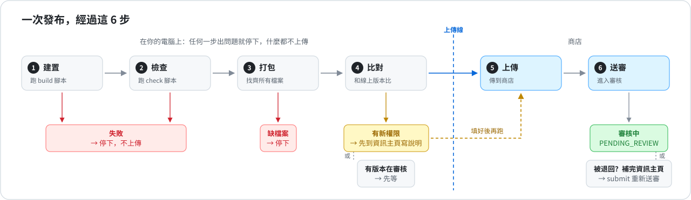
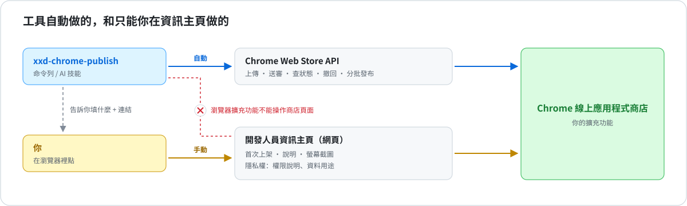

# xxd-chrome-publish

[简体中文](README.md) · **繁體中文** · [English](README.en.md) · [日本語](README.ja.md) · [한국어](README.ko.md) · [Español](README.es.md) · [Français](README.fr.md) · [Deutsch](README.de.md) · [العربية](README.ar.md)

**一行指令，發布 Chrome 擴充功能的更新。**
自動建置、打包、上傳、送審。上傳之前就告訴你，商店會不會退回。

可以當指令用，也可以裝進 Claude Code / Codex，直接說「把這個擴充功能發布出去」。

> 只適用於已經上架的擴充功能。第一次上架還是要到 Chrome 資訊主頁。



## 它幫你解決什麼


| 以前 | 現在 |
|---|---|
| 上傳成功，送審卻被退回：*「does not meet the requirements」* | 事先告訴你哪個權限要到資訊主頁寫說明，還指出程式碼哪一行用到它 |
| 程式之後才載入的檔案沒打進套件，發布後功能壞掉 | 自動找出來，一起打包 |
| 不小心上傳了舊的建置 | 先執行你的建置和測試腳本，失敗就不上傳 |
| 版本號和商店衝突被退回 | 同時參考程式碼和商店，算出下一個版本號 |
| 記不清哪些擴充功能有變更還沒發布 | 一張表全部列出來 |

## 快速開始

**1. 安裝**

```bash
git clone https://github.com/nevertoday/xxd-chrome-publish ~/code/xxd-chrome-publish
ln -s ~/code/xxd-chrome-publish ~/.claude/skills/xxd-chrome-publish   # 當 Claude 技能用（Codex 是 ~/.codex/skills）
sh ~/code/xxd-chrome-publish/scripts/install.sh                       # 當指令用
```

**2. 連上你的商店帳號**（只需一次，[詳細步驟](references/setup.md)）

```bash
xxd-chrome-publish setup --publisher-id <資訊主頁網址裡的 ID> --service-account <服務帳戶 email>
```

**3. 為每個擴充功能資料夾綁定 ID**（只需一次）

```bash
cd 擴充功能資料夾
xxd-chrome-publish bind --extension-id <擴充功能 ID 或商店連結>
```

**4. 發布**

```bash
xxd-chrome-publish
```

## 常用指令

| 你想 | 輸入 |
|---|---|
| 先看看會發生什麼，什麼都不改 | `xxd-chrome-publish preflight` |
| 發布更新 | `xxd-chrome-publish` |
| 資訊主頁補完資料，重新送審 | `xxd-chrome-publish submit` |
| 查審核進度 | `xxd-chrome-publish status` |
| 看哪些擴充功能有變更還沒發布 | `xxd-chrome-publish scan ~/code` |
| 檢查設定對不對 | `xxd-chrome-publish doctor` |

在 Claude Code / Codex 裡直接說就好：*「把 flomo 那個擴充功能發布出去」*、*「看看哪些擴充功能可以發布」*。

## 檢查結果長這樣

```
$ xxd-chrome-publish preflight
Image Crop Tool · ~/code/crop · phdjhhjbapkmagifbejfabimojmjngbe
  store     PUBLISHED 1.0.26
  version   1.0.26 → 1.0.27
  package   27 files · 249 KB
  manifest  vs store: +hosts https://api.example.com/*
  dashboard 1 to-do:
    [required] Justify the new host permissions
    open https://chrome.google.com/webstore/devconsole/…/edit/privacy
  => NEEDS DASHBOARD
```

這次檢查發現新增了一個網站權限。打開連結，寫一句擴充功能為什麼需要它，儲存，再發布就好。

## 它做不到的



下面這些 Google 沒有開放 API，只能在 Chrome 資訊主頁操作：

- 第一次上架
- 商店說明和螢幕截圖
- 隱私權分頁：權限說明、資料用途、隱私權政策連結

工具會告訴你具體要填什麼、到哪裡填。瀏覽器 AI 助理也沒辦法代填，因為 Chrome 不允許任何擴充功能操作商店頁面。

## 細節（點開看）

<details>
<summary><b>登入方式：兩種選一種</b></summary>

| 方式 | 適合 | 需要什麼 |
|---|---|---|
| gcloud + 服務帳戶 | 自己電腦上用，不存金鑰檔 | 安裝 Google Cloud SDK，建立一個服務帳戶 |
| OAuth refresh token | CI（例如 GitHub Actions） | `CWS_CLIENT_ID`、`CWS_CLIENT_SECRET`、`CWS_REFRESH_TOKEN` 三個環境變數 |

⚠️ 服務帳戶要填在資訊主頁 Account 頁的 **service account** 欄位，**不是**旁邊的「Trusted tester accounts」。那一欄沒有 API 權限，填錯會一直出現 403。

完整步驟：[references/setup.md](references/setup.md)

</details>

<details>
<summary><b>全部參數</b></summary>

| 參數 | 作用 |
|---|---|
| `--minor` / `--major` | 1.2.3 → 1.3.0 / 2.0.0（預設是 1.2.4） |
| `--set-version 1.5.0` | 就用這個版本號 |
| `--no-bump` | 不改版本號，用 manifest.json 裡現有的 |
| `--skip-build` / `--skip-checks` | 不執行建置 / 測試腳本 |
| `--dashboard-ready` | 資訊主頁已經填好了，繼續發布 |
| `--cancel-pending` | 撤回審核中的版本，改送這一版 |
| `--upload-only` | 只上傳，不送審 |
| `--staged` | 審核通過後先不上線，等你手動發布 |
| `--zip 檔案.zip` | 直接上傳這個 ZIP，不重新打包 |
| `--commit` | 發布後把新版本號提交到 git |
| `--json` | 輸出 JSON，方便程式讀取 |

結束代碼：`0` 完成 · `1` 錯誤 · `2` 有別的版本在審核 · `3` 要先到資訊主頁補資料

</details>

<details>
<summary><b>每個擴充功能的設定</b>（<code>.chrome-publish.json</code>）</summary>

```json
{
  "extensionId": "abcdefghijklmnopabcdefghijklmnop",
  "build": "npm run build",
  "check": false,
  "packageDir": "dist",
  "include": ["assets/models/**"],
  "exclude": ["fixtures/**"]
}
```

| 欄位 | 意思 |
|---|---|
| `extensionId` | 商店連結裡那串 32 個字母 |
| `build` | 建置指令，或 `false`。預設用 package.json 裡的 `build` 腳本 |
| `check` | 測試指令，或 `false`。預設用 package.json 裡的 `check` 腳本 |
| `packageDir` | 要打包的資料夾，例如建置輸出到 `dist` 時填它 |
| `include` / `exclude` | 一定要打包 / 一定不打包的檔案 |

</details>

<details>
<summary><b>更新和開發</b></summary>

```bash
git -C ~/code/xxd-chrome-publish pull   # 更新（技能連結和指令都指向這裡）
npm test                                 # 執行測試（用本機假商店，不會真的發布）
npm run diagrams                         # 重新產生示意圖（改了 build.mjs 裡的文字後）
```

權限說明怎麼寫比較容易過審：[references/dashboard.md](references/dashboard.md) ·
錯誤訊息和解法：[references/troubleshooting.md](references/troubleshooting.md)

</details>

MIT 授權
